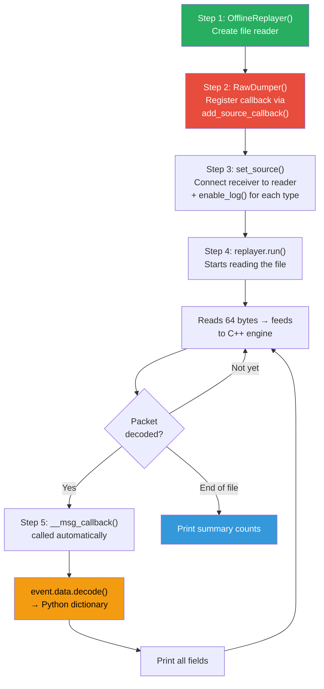

# How the Raw Dump Script Works

## Purpose

This script reads a [.mi2log](file:///home/venu/Desktop/mobileinsight_logs/capture_live_mac.mi2log) binary file (captured from the phone's modem) and prints out every single field that was decoded — so we can see what data is available for our ML dataset.

---

## The 3 Components It Uses

| Component | File | Role |
|-----------|------|------|
| **OfflineReplayer** | [offline_replayer.py](file:///home/venu/Downloads/MobileInsight-6.0.0/mobile_insight/monitor/offline_replayer.py) | Reads the [.mi2log](file:///home/venu/Desktop/mobileinsight_logs/capture_live_mac.mi2log) file and feeds it to the C++ decoder |
| **Analyzer** | [analyzer.py](file:///home/venu/Downloads/MobileInsight-6.0.0/mobile_insight/analyzer/analyzer.py) | Base class that provides the callback system to receive decoded packets |
| **dm_collector_c** | `dm_collector_c.so` (compiled from [log_packet.cpp](file:///home/venu/Downloads/MobileInsight-6.0.0/dm_collector_c/log_packet.cpp)) | The C++ engine that translates Qualcomm proprietary binary into Python data |

---

## Step-by-Step Flow

### Step 1 — Create the file reader

We create an [OfflineReplayer](file:///home/venu/Downloads/MobileInsight-6.0.0/mobile_insight/monitor/offline_replayer.py#22-235) object and give it the path to our [.mi2log](file:///home/venu/Desktop/mobileinsight_logs/capture_live_mac.mi2log) file. At this point nothing happens yet — it just stores the file path.

> Functions used: [OfflineReplayer()](file:///home/venu/Downloads/MobileInsight-6.0.0/mobile_insight/monitor/offline_replayer.py#22-235) and [set_input_path()](file:///home/venu/Downloads/MobileInsight-6.0.0/mobile_insight/monitor/offline_replayer.py#132-142) from [offline_replayer.py](file:///home/venu/Downloads/MobileInsight-6.0.0/mobile_insight/monitor/offline_replayer.py)

### Step 2 — Create our receiver and register a callback

We create our own class called [RawDumper](file:///tmp/dump_mi2log_raw.py#43-186) which inherits from [Analyzer](file:///home/venu/Downloads/MobileInsight-6.0.0/mobile_insight/analyzer/analyzer.py#29-247). Inside its constructor, we call [add_source_callback()](file:///home/venu/Downloads/MobileInsight-6.0.0/mobile_insight/analyzer/analyzer.py#89-98) and pass it our own function called [__msg_callback](file:///tmp/dump_mi2log_raw.py#99-153). This tells the framework: "every time a packet is decoded, call my function automatically."

> Functions used: `Analyzer.__init__()` and [add_source_callback()](file:///home/venu/Downloads/MobileInsight-6.0.0/mobile_insight/analyzer/analyzer.py#89-98) from [analyzer.py](file:///home/venu/Downloads/MobileInsight-6.0.0/mobile_insight/analyzer/analyzer.py)

### Step 3 — Wire the receiver to the file reader

We call [set_source()](file:///tmp/dump_mi2log_raw.py#68-98) which does two things at once:
1. It connects our [RawDumper](file:///tmp/dump_mi2log_raw.py#43-186) to the [OfflineReplayer](file:///home/venu/Downloads/MobileInsight-6.0.0/mobile_insight/monitor/offline_replayer.py#22-235) so the replayer knows where to send decoded packets.
2. It calls [enable_log()](file:///home/venu/Downloads/MobileInsight-6.0.0/mobile_insight/monitor/dm_collector/dm_collector.py#77-97) for each packet type we want — like `"LTE_RRC_OTA_Packet"` and `"LTE_MAC_UL_Transport_Block"`. This tells the C++ engine which types to decode and which to skip.

> Functions used: [set_source()](file:///tmp/dump_mi2log_raw.py#68-98) from [analyzer.py](file:///home/venu/Downloads/MobileInsight-6.0.0/mobile_insight/analyzer/analyzer.py) and [enable_log()](file:///home/venu/Downloads/MobileInsight-6.0.0/mobile_insight/monitor/dm_collector/dm_collector.py#77-97) from [offline_replayer.py](file:///home/venu/Downloads/MobileInsight-6.0.0/mobile_insight/monitor/offline_replayer.py)

### Step 4 — Press Play

We call `replayer.run()`. This starts a loop that:
1. Reads 64 bytes from the [.mi2log](file:///home/venu/Desktop/mobileinsight_logs/capture_live_mac.mi2log) file
2. Passes them to the C++ engine via `feed_binary()`
3. Asks the C++ engine for a decoded packet via `receive_log_packet()`
4. If a packet is ready, wraps it in a [DMLogPacket](file:///home/venu/Downloads/MobileInsight-6.0.0/mobile_insight/monitor/dm_collector/dm_endec/dm_log_packet.py#50-508) object and fires an [Event](file:///home/venu/Downloads/MobileInsight-6.0.0/gui/mobile_insight_gui.py#44-49) to our callback

This loop repeats until the entire file is read.

> Functions used: [run()](file:///home/venu/Downloads/MobileInsight-6.0.0/mobile_insight/monitor/offline_replayer.py#154-235) from [offline_replayer.py](file:///home/venu/Downloads/MobileInsight-6.0.0/mobile_insight/monitor/offline_replayer.py), which internally calls `feed_binary()` and `receive_log_packet()` from `dm_collector_c`

### Step 5 — Our callback receives each packet

Every time a packet is decoded, the framework calls our [__msg_callback()](file:///tmp/dump_mi2log_raw.py#99-153) function. Inside it, we call `event.data.decode()` — this is the critical line that converts the C++ engine's raw output into a plain Python dictionary. We then print that entire dictionary with all its fields and nested values.

> Functions used: [recv()](file:///home/venu/Downloads/MobileInsight-6.0.0/mobile_insight/analyzer/analyzer.py#216-238) from [analyzer.py](file:///home/venu/Downloads/MobileInsight-6.0.0/mobile_insight/analyzer/analyzer.py) triggers our [__msg_callback()](file:///tmp/dump_mi2log_raw.py#99-153), which calls [decode()](file:///home/venu/Downloads/MobileInsight-6.0.0/mobile_insight/monitor/dm_collector/dm_endec/dm_log_packet.py#348-387) from [dm_log_packet.py](file:///home/venu/Downloads/MobileInsight-6.0.0/mobile_insight/monitor/dm_collector/dm_endec/dm_log_packet.py)

---

## Visual Flow

---

## What the Output Looks Like

For each decoded packet, we get a Python dictionary. For example, one MAC UL Transport Block packet gives us:

- **Timestamp** — when the modem recorded this packet
- **Subpackets** — a list containing the transport block data
  - **Samples** — each subpacket has multiple samples (typically 10–20 per packet)
    - **HARQ ID** — the hybrid ARQ process number
    - **RNTI Type** — radio identifier type (C-RNTI, SPS-RNTI, etc.)
    - **Grant (bytes)** — how many bytes the network allocated for this transmission
    - **Padding (bytes)** — unused bytes in the grant
    - **BSR event** — whether a Buffer Status Report was triggered
    - **Mac Hdr + CE** — MAC header with Logical Channel IDs (LCIDs)

This is the raw ground truth. Our CSV parser reads these exact same dictionaries — it just picks specific fields instead of printing everything.
